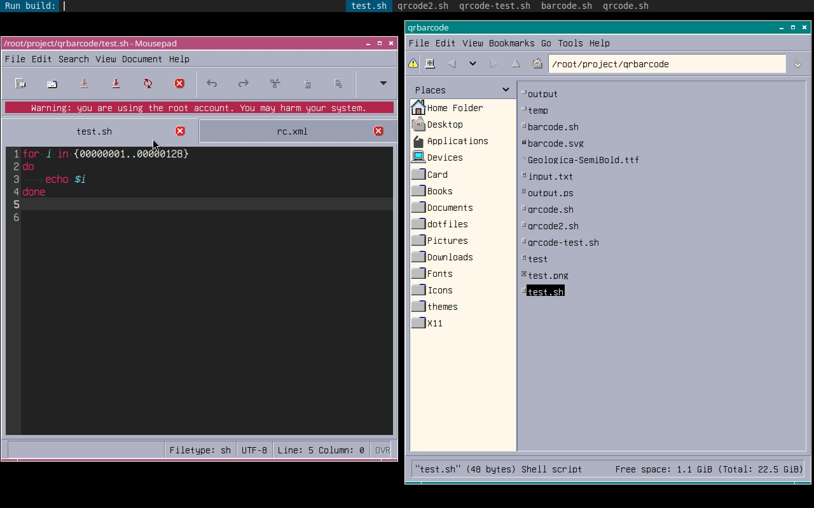
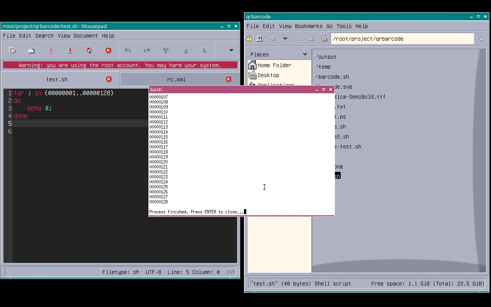

# openbox-build

A simple Bash script to display a list of build scripts in a directory using `dmenu` and execute the chosen one.

## Features

•   **Dynamic Script Listing:** Automatically finds executable files and `.sh` files in a specified directory.
•   **Sort by Modification Time:** Lists scripts with the most recently modified ones appearing first.
•   **`dmenu` Integration:** Uses `dmenu` for an interactive and efficient way to select scripts.
•   **Terminal or Background Execution:** Choose to run scripts within a terminal for visibility or in the background.
•   **Customizable Terminal:** Easily configure your preferred terminal emulator.
•   **Dependency Check:** Verifies if `dmenu` is installed.

## Requirements

•   `bash`
•   `dmenu` (or a compatible alternative if `TERMINAL_CMD` is adjusted)
•   `find`
•   `sort`
•   `cut`
•   `notify-send` (for error/info messages)

## Installation

1.  **Clone the repository (if you are using a Git repository for this script):**

  Or, simply copy the openbox-build.sh file to your desired location (e.g., ~/.local/bin/).

2. Make the script executable:
  
```

bash
  chmod +x openbox-build.sh

```

3. Place the script in your PATH or a dedicated directory:
  •  For example, to make it accessible system-wide (requires sudo):
    
```

bash
    sudo mv openbox-build.sh /usr/local/bin/

```
  •  Or, place it in your user's local bin directory:
    
```

bash
    mv openbox-build.sh ~/.local/bin/

```
    (Ensure ~/.local/bin is in your $PATH).

4. Create your scripts directory:
  
```

bash
  mkdir -p ~/.local/bin/build-scripts

```

5. Add your build scripts to ~/.local/bin/build-scripts/ and make them executable:
  
```

bash
  # Example: Create a sample script
  echo '#!/bin/bash' > ~/.local/bin/build-scripts/my_build_script.sh
  echo 'echo "Building project..."' >> ~/.local/bin/build-scripts/my_build_script.sh
  echo 'sleep 2' >> ~/.local/bin/build-scripts/my_build_script.sh
  echo 'echo "Build complete!"' >> ~/.local/bin/build-scripts/my_build_script.sh
  chmod +x ~/.local/bin/build-scripts/my_build_script.sh

```

 Usage

Simply run the script from your terminal:


```

bash
openbox-build.sh

```

or

```
    <keybind key="C-Tab">
      <action name="Execute">
        <command>bash /root/.local/bin/openbox-build.sh</command>
      </action>
    </keybind>
```

This will open dmenu with a prompt like "Run build:". Type the name of the script you want to run and press Enter.

 Configuration

You can customize the behavior of openbox-build.sh by setting environment variables or modifying the script directly:

•  SCRIPTS_DIR: Specifies the directory containing your build scripts.
  •  Default: $HOME/.local/bin/build-scripts
  •  Example: SCRIPTS_DIR="$HOME/my-scripts" openbox-build.sh

•  RUN_IN_TERMINAL: Controls how scripts are executed.
  •  1 (default): Run in a terminal window, showing output. The terminal will wait for you to press Enter before closing.
  •  0: Run in the background. Output is discarded.

•  TERMINAL_CMD: Sets the command to launch your preferred terminal emulator.
  •  Default: xterm -e
  •  Examples:
    *  TERMINAL_CMD="kitty -e"
    *  TERMINAL_CMD="alacritty -e"
    *  TERMINAL_CMD="urxvt -e"

You can set these variables in your shell's configuration file (e.g., ~/.bashrc, ~/.zshrc) for persistent changes:


```

bash
# Example for ~/.bashrc
export SCRIPTS_DIR="$HOME/custom-build-scripts"
export TERMINAL_CMD="alacritty -e"
export RUN_IN_TERMINAL=1

```

 How it Works

1. Find Scripts: The script uses find to locate files in the SCRIPTS_DIR. It includes files that are directly executable (-perm -111) or have the .sh extension (-name '*.sh').
2. Sort by Time: The find command outputs files with their modification timestamps. These are then sorted numerically in reverse order (sort -rn) to place the newest files at the top. The timestamp is then removed, leaving just the filenames.
3. dmenu Prompt: The sorted list of filenames is piped to dmenu, which presents an interactive menu for the user.
4. Execute Script:
  •  If RUN_IN_TERMINAL is set to 1, the selected script is executed within the specified terminal emulator. The terminal command includes instructions to print the script being run, execute it, and then prompt the user to press Enter before closing.
  •  If RUN_IN_TERMINAL is 0, the script is executed in the background using setsid to detach it from the current terminal session, and its output is redirected to /dev/null.

 Contributing

Contributions are welcome! Please feel free to submit a pull request or open an issue if you have any suggestions or encounter problems.
